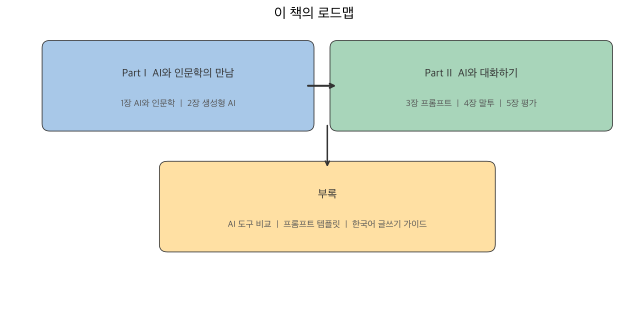

# 시작하며

이 책은 인문학을 전공하는 학생들이 인공지능, 특히 생성형 AI를 자신의 학문적 탐구와 실무에 활용할 수 있도록 안내하는 입문서입니다.

## 이 책의 대상

코딩 경험이 없어도 괜찮습니다. AI 기술의 원리를 깊이 파고들기보다는, AI라는 도구를 인문학적 상상력으로 다루는 방법에 집중합니다. 글을 쓰고, 질문을 던지고, 텍스트를 분석하는 일 — 인문학도가 이미 잘하는 것들이 AI 시대에 어떤 힘을 발휘하는지 살펴봅니다.

## 이 책의 구성

**Part I — AI와 인문학의 만남**에서는 디지털 인문학의 흐름을 짚고, 생성형 AI가 무엇인지, 어떤 데이터로 학습하는지를 알아봅니다. AI가 바꾸고 있는 인문학의 풍경을 조망하되, 데이터의 한계가 곧 AI의 한계라는 점도 함께 짚습니다.

**Part II — AI와 대화하기**에서는 프롬프트 작성법을 다룹니다. 같은 질문이라도 어떻게 묻느냐에 따라 답변 품질이 달라지는데, 4원칙을 배우고 나면 그 차이를 직접 체감하게 됩니다. 말투를 바꿔 글을 쓰는 법, AI가 쓴 글의 전형적 문제를 식별하고 교정하는 법까지 다룹니다.

**부록**에는 주요 AI 도구 비교표, 바로 쓸 수 있는 프롬프트 템플릿, 한국어 글쓰기에서 자주 발생하는 AI 문체 문제와 교정 기준을 정리했습니다.

## 저자

**송영숙** — 단국대학교 문과대학. 인문학과 기술의 접점에서 학생들이 AI를 자신의 도구로 삼을 수 있도록 돕고 있습니다.
