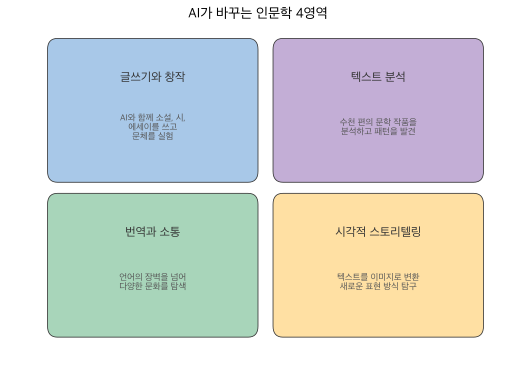

# 1장 인공지능 시대, 인문학의 새로운 가능성

## 디지털 인문학이란?

디지털 인문학(Digital Humanities)은 디지털 기술을 활용하여 인문학적 질문에 답하고, 동시에 인문학적 관점으로 디지털 기술의 의미를 성찰하는 학문 분야입니다. 컴퓨터가 등장한 이후 인문학자들은 기술을 연구 도구로 받아들여 왔는데, 그 과정은 단순한 도구 변화가 아니라 학문 자체의 확장이기도 했습니다.

2000년대에는 디지털 아카이브와 전자 텍스트 구축이 중심이었습니다. 종이에 갇혀 있던 고전 텍스트를 디지털화하고, 검색 가능한 형태로 만드는 작업이 본격적으로 이루어졌죠. 2010년대에 접어들면서 빅데이터 분석과 텍스트 마이닝, 시각화 기법이 인문학 연구에 도입되었고, 수천 편의 문학 작품을 동시에 분석하는 '원거리 읽기(distant reading)' 같은 방법론이 등장했습니다.

2020년대에는 생성형 AI와 대규모 언어모델(LLM)이 등장하면서 인문학과 기술의 관계가 다시 한번 근본적으로 바뀌고 있습니다. AI가 글을 쓰고, 번역하고, 이미지를 생성하는 시대 — 인문학자에게 이 기술은 위협이 아니라 새로운 탐구의 도구가 될 수 있습니다.

## AI가 바꾸는 인문학의 풍경

AI는 인문학의 여러 영역에서 새로운 가능성을 열어놓았습니다.

### 글쓰기와 창작

AI와 함께 소설, 시, 에세이를 쓰고 문체를 실험할 수 있습니다. 김수영 스타일로 봄비를 주제로 현대시를 써달라고 요청하거나, 소설의 다음 장면에 반전을 넣어달라고 할 수도 있죠. AI는 초안을 빠르게 만들어주는 조수 역할을 하고, 작가는 그 위에 자신만의 시선과 감성을 입힙니다.

### 텍스트 분석

수천 편의 문학 작품을 분석하고 패턴을 발견할 수 있습니다. 특정 시대의 소설에서 여성 인물이 어떻게 묘사되었는지, 특정 작가의 어휘 사용이 시간에 따라 어떻게 변했는지 — 이런 질문에 AI는 사람의 독서 속도로는 불가능한 규모의 분석을 제공합니다.

### 번역과 소통

언어의 장벽을 넘어 다양한 문화를 탐색할 수 있습니다. 단순 번역을 넘어, 뉘앙스의 차이나 문화적 맥락까지 설명을 요청할 수 있다는 점에서 기존 번역 도구와 다릅니다.

### 시각적 스토리텔링

텍스트를 이미지로 변환하여 새로운 표현 방식을 탐구합니다. 문학 작품의 장면을 시각화하거나, 데이터를 의미 있는 이야기로 엮어내는 데 AI가 도움을 줍니다.

## 인문학 전공자의 강점

AI 시대에 인문학 전공자가 갖는 강점은 분명합니다.

첫째, **질문 설계 능력**입니다. 인문학도는 좋은 질문을 만드는 훈련을 받았고, 이 능력은 프롬프트 작성과 직결됩니다. 둘째, **비판적 사고**입니다. AI의 답변을 그대로 받아들이지 않고 평가하는 습관은 AI 활용의 핵심 역량이죠. 셋째, **맥락 이해력**입니다. 텍스트의 맥락과 뉘앙스를 읽는 능력이 뛰어난 사람이 AI에게 더 정교한 지시를 내릴 수 있습니다. 넷째, **스토리텔링**입니다. 데이터를 의미 있는 이야기로 엮어내는 것은 인문학도의 강점이고, AI가 생성한 결과물을 다듬고 맥락을 부여하는 데 이 능력이 빛을 발합니다.

문제를 잘 정의하고 좋은 질문을 던지는 것, 결과를 비판적으로 평가하고 해석하는 것 — 이것이 AI 시대에 인문학이 가장 잘할 수 있는 일입니다.
