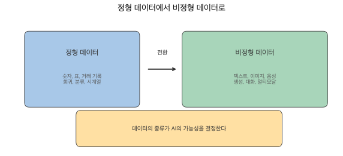
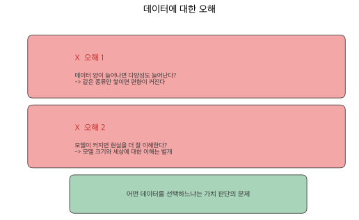
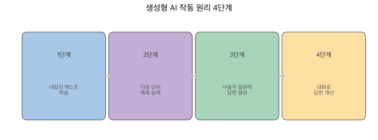

# 2장 생성형 AI 이해하기

## 생성형 AI란?

생성형 AI(Generative AI)는 사용자의 요청(프롬프트)에 따라 새로운 텍스트, 이미지, 코드 등 콘텐츠를 만들어내는 인공지능 기술입니다. 기존 AI가 분류, 예측, 추천처럼 이미 있는 데이터에서 패턴을 찾는 일에 집중했다면, 생성형 AI는 아예 없던 콘텐츠를 새로 만들어낸다는 점에서 근본적으로 다릅니다.

이 변화의 중심에는 대규모 언어모델(LLM, Large Language Model)이 있습니다. 수십억 개의 텍스트로 학습한 LLM은 2022년 ChatGPT의 등장과 함께 폭발적으로 성장했고, 이제는 글쓰기, 번역, 코딩, 이미지 생성까지 다양한 영역에서 쓰이고 있습니다.

## 검색 AI와 생성형 AI의 차이

검색 AI는 이미 존재하는 정보를 찾아서 보여줍니다. 구글 검색에 질문을 입력하면 관련 웹페이지 목록이 나오고, 사용자가 직접 읽으며 원하는 정보를 골라야 하죠. 반면 생성형 AI는 질문을 이해하고 새로운 답변을 직접 만들어냅니다. ChatGPT에 같은 질문을 던지면 맞춤형 답변을 작성해 주고, 대화하듯 추가 질문으로 답변을 개선할 수도 있습니다.

핵심 차이를 한 마디로 줄이면 이렇습니다. 검색 AI는 '찾아주고', 생성형 AI는 '만들어줍니다'.

## AI 기술의 계층 구조

AI 기술은 넓은 개념에서 좁은 개념으로 층층이 쌓여 있습니다.

**인공지능(AI)**은 사람의 지능을 모방하는 모든 기술을 포괄하는 가장 넓은 개념입니다. 그 안에 **머신러닝(ML)**이 있는데, 명시적으로 프로그래밍하지 않아도 데이터에서 패턴을 스스로 학습하는 방법론이죠. 머신러닝 안에 **딥러닝(DL)**이 있습니다. 인공 신경망을 여러 겹 쌓아 복잡한 패턴을 학습하는 방식인데, 이미지 인식이나 자연어 처리에서 큰 성과를 거두었습니다. 그리고 딥러닝의 한 갈래로 **LLM**이 있습니다. 대규모 텍스트 데이터로 학습한 언어 특화 모델로, ChatGPT나 Claude가 바로 이 범주에 속합니다.

AI 산업은 **데이터(Data)**, **모델(Model)**, **서비스(Product)** 세 가지가 맞물려 돌아갑니다. 좋은 데이터 없이는 좋은 모델이 나올 수 없고, 좋은 모델 없이는 좋은 서비스도 만들어지지 않습니다.

## ML에서 LLM으로: 시대의 전환

**Classical ML 시대(1990~2010년대 중반)**에는 SVM, Random Forest 같은 알고리즘이 주류였고, 주로 정형 데이터(표, 숫자)를 다루었습니다. 금융 예측, 제조 품질 관리처럼 도메인에 특화된 문제를 풀었죠.

**전환점(2017~2022년)**에서 판도가 바뀝니다. 2017년 Transformer 아키텍처가 등장하고, BERT(2018), GPT-2(2019), GPT-3(2020)가 차례로 나오면서 대형 언어 모델의 가능성이 확인되었습니다. 2022년 ChatGPT가 출시되면서 LLM은 대중화의 단계로 접어듭니다.

**LLM 시대(2020년대~)**에는 텍스트 생성 중심으로 AI 지형이 급변하고 있습니다. 비정형 데이터(텍스트, 이미지, 음성)의 비중이 폭발적으로 늘었고, 누구나 AI를 '대화'로 사용하는 시대가 열렸습니다. 코딩을 모르더라도 말로 설명해서 도구를 만드는 '바이브 코딩'이 등장한 것도 이 시대의 특징입니다.

## 데이터가 결정하는 AI의 가능성과 한계

### 과거: 정형 데이터 중심

과거 AI는 구조화된 데이터로 예측, 분류, 의사결정을 지원했습니다. 회귀(주택 가격 예측), 분류(스팸 메일 필터), 시계열(주가 변동 예측), 표 데이터(고객 정보 분석) — 이 모든 작업의 공통점은 숫자로 정리할 수 있는 '정형 데이터'를 다루었다는 점입니다.

### 전환기에서 현재로

전환기에는 한국어 NLP 데이터가 양적으로 팽창했습니다. 국립국어원(모두의 말뭉치), AI HUB, 네이버(NLP Challenge) 등이 주요 데이터 제공자로 활동했고, word2vec으로 대표되는 벡터 임베딩 시기에 단어나 문장의 의미 연구가 활발했습니다.

LLM 이후에는 데이터 지형이 크게 바뀌었습니다. 양질의 데이터란 무엇인지 — 신뢰성, 대표성, 라이선스, 언어, 크기, 문서화 정도 — 를 종합적으로 따져야 하는 시대가 되었습니다. 텍스트 생성 과제가 전체 데이터셋의 30~40%를 차지하며 가장 큰 비중을 차지하게 되었고, 한국어 데이터셋은 소규모에 집중되어 초대형 데이터셋은 아직 부족한 상황입니다.

### 데이터에 대한 오해

AI와 데이터의 관계에서 흔히 빠지는 오해 두 가지가 있습니다.

!!! warning "오해 1: 데이터 양이 늘어나면 다양성도 늘어난다"
    양이 많아도 같은 종류의 데이터만 쌓이면 편향이 커집니다. 데이터의 양과 다양성은 별개의 문제입니다.

!!! warning "오해 2: 모델이 커지면 현실을 더 잘 이해한다"
    모델 크기와 '세상에 대한 이해'는 별개입니다. 파라미터 수가 아무리 많아도 학습 데이터에 담기지 않은 관점이나 경험은 모를 수밖에 없습니다.

어떤 데이터를 선택하느냐는 기술적 판단이 아니라 '가치 판단'의 문제입니다. AI가 배우지 못한 것은 데이터에 담기지 않은 것이죠. 인문학적 관점으로 데이터를 바라보는 것이 AI를 제대로 활용하는 출발점입니다.

### AI의 한계는 데이터의 결과

> AI의 한계는 모델이 아니라 우리가 선택한 데이터의 결과다.

AI는 학습한 데이터의 범위 안에서만 답변할 수 있습니다. 데이터에 없는 관점, 문화, 경험은 AI가 '모르는' 영역이고, 한국어 데이터가 부족하면 한국어 AI의 성능도 떨어집니다. 데이터를 선별하고 평가하는 능력이 AI 시대의 핵심 역량인 셈입니다.

## 생성형 AI의 작동 원리

생성형 AI가 어떻게 답변을 만들어내는지, 아주 간단하게 살펴봅시다.

**1단계**에서 AI는 엄청나게 많은 텍스트(책, 웹사이트, 논문 등)를 읽고 학습합니다. **2단계**에서 이 학습을 통해 '다음에 올 단어'를 예측하는 능력을 갖추게 됩니다. **3단계**에서 사용자의 질문을 받으면 학습한 지식을 바탕으로 답변을 '생성'하고, **4단계**에서 대화를 통해 답변을 개선하고 구체화합니다.

비유하자면, 수만 권의 책을 읽은 박식한 조수에게 질문하는 것과 비슷합니다. 다만 이 조수는 가끔 자신이 없어도 자신있게 답하는 경우가 있는데, 이것이 바로 '환각(hallucination)' 현상입니다. AI의 답변을 무조건 신뢰하지 않고 검증하는 습관이 필요한 이유이기도 합니다.
