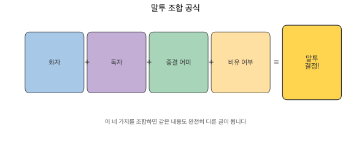

# 4장 말투 변환으로 글쓰기

같은 내용이라도 누가, 누구에게, 어떤 상황에서 말하느냐에 따라 글의 성격이 완전히 달라집니다. 프롬프트에 말투를 지정하면 AI도 그에 맞는 문체로 글을 써주는데, 이 장에서는 말투를 바꾸는 핵심 요소를 배우고 6가지 말투의 실제 결과를 비교합니다.

## 말투를 바꾸는 핵심 요소 4가지

| 요소 | 설명 | 예시 |
|------|------|------|
| **화자 설정** | '누가 쓴 글인가'를 명시하면 AI가 해당 인물의 어휘와 문체를 흉내냄 | '10년차 DevOps 엔지니어', '대학 조교' |
| **종결 어미 지정** | 한국어는 종결 어미가 톤을 결정함 | 격식: ~입니다 / 구어: ~거든요 / 반말: ~거야 |
| **비유·예시 여부** | 비유를 넣으면 친근해지고, 빼면 격식이 올라감 | '피자처럼 나눠 먹는다' vs 수치만 제시 |
| **독자 설정** | '누구에게 쓰는 글인가'가 어휘 수준과 설명 깊이를 결정함 | '비전공자', 'AI 인프라 팀장' |

## 조합 프롬프트 공식



이 네 가지 요소를 조합하는 공식이 있습니다.

```
다음 글을 [화자]가 [독자]에게 [매체/상황]에서 전달하는 말투로 다시 써 주세요.
- [종결 어미 스타일]
- [비유/예시 사용 여부]
- [전문 용어 처리 방식]
- [문장 길이/호흡]

[원문 붙여넣기]
```

이 공식에 구체적인 값을 넣으면 말투가 결정됩니다. 아래에서 같은 원문을 6가지 말투로 바꾼 결과를 비교합니다.

## 실습 원문

다음 기술 블로그 단락을 6가지 말투로 변환합니다.

> Backend.AI의 고유 기술인 fGPU는 컨테이너 수준에서 GPU를 분할하여 공유하거나 다중 GPU를 하나의 컨테이너에 할당합니다. 이를 통해 H100 80GB를 8GB씩 10개의 가상 GPU로 분할할 수 있으며, 특히 소형 모델(7B 이하)의 멀티테넌트 환경에서 효율적입니다. GPU 사용률이 0%, CPU 사용률이 5% 미만인 상태가 10분 이상 지속되면 자동으로 자원을 회수하여, 유휴 자원 낭비를 최소화합니다.

## 6가지 말투 비교

### A. 강의형 — 교수가 학생에게

!!! example "프롬프트"
    ```
    다음 기술 블로그 단락을 "대학 강의에서 학생들에게 설명하는 교수"의 말투로 다시 써 주세요.
    - 개념을 하나씩 풀어서 설명하세요
    - "~거든요", "~인데요", "~잖아요" 같은 구어체 종결 어미를 사용하세요
    - 비유나 예시를 넣어 이해를 도와주세요
    - 전문 용어가 나오면 바로 옆에 쉬운 설명을 붙여주세요
    ```

!!! quote "생성 결과"
    GPU라는 게 비싼 자원이잖아요. H100 하나가 수천만 원인데, 한 사람이 통째로 쓰고 있으면 나머지 사람들은 손가락만 빨고 있어야 하거든요. Backend.AI의 fGPU라는 기술은 이 GPU를 잘게 쪼개서 여러 사람이 나눠 쓸 수 있게 해 줍니다. 마치 큰 피자 한 판을 여러 조각으로 나눠 먹는 것과 비슷한데요, H100 80GB짜리를 8GB씩 10조각으로 나눌 수 있어요. 7B 이하 소형 모델을 돌리는 정도라면 이 한 조각이면 충분합니다. 그리고 재미있는 건, 누군가 GPU를 받아놓고 10분 넘게 안 쓰고 있으면 시스템이 알아서 그 자원을 회수해 간다는 거예요. 컴퓨터실에서 자리만 맡아놓고 딴 데 가 있으면 다른 학생한테 양보하는 것과 같은 원리입니다.

---

### B. 경험자형 — 현장 엔지니어

!!! example "프롬프트"
    ```
    다음 기술 블로그 단락을 "GPU 클러스터를 실제로 수년간 운영해 본 엔지니어"의 말투로 다시 써 주세요.
    - 실제 겪은 문제와 해결 경험이 묻어나게 하세요
    - "해 보니까", "실제로는", "현실적으로" 같은 경험 기반 표현을 사용하세요
    - 기술 용어는 자연스럽게 사용하되, 현장의 뉘앙스를 담아주세요
    - 과장 없이 담담하게 서술하세요
    ```

!!! quote "생성 결과"
    GPU 클러스터를 운영해 보면 제일 골치 아픈 게 활용률입니다. 한 팀에서 H100을 통째로 잡아두고 실제로 연산에 쓰는 건 메모리의 10%도 안 되는 경우가 허다하거든요. fGPU를 도입하고 나서 이 문제가 눈에 띄게 줄었는데, 80GB짜리 H100을 8GB 단위로 쪼개서 배분하니까 7B급 모델 정도는 한 GPU에서 열 명이 동시에 돌릴 수 있게 됐습니다. 자동 회수 기능도 실무에서 꽤 유용한 게, 예전에는 GPU 잡아두고 퇴근해 버리는 연구원 때문에 새벽에 슬랙으로 "GPU 좀 반납해 주세요" 하는 일이 잦았는데, 지금은 10분 이상 유휴 상태면 시스템이 알아서 풀어줍니다.

---

### C. 보고서형 — 임원 보고

!!! example "프롬프트"
    ```
    다음 기술 블로그 단락을 "기업 임원에게 보고하는 공식 기술 보고서"의 말투로 다시 써 주세요.
    - 격식 있는 문어체를 사용하세요 ("~입니다", "~됩니다", "~바 있습니다")
    - 수치와 효과를 명확히 제시하세요
    - 감정적 표현을 배제하고 객관적으로 서술하세요
    - 핵심 내용을 앞에 배치하세요 (결론 우선)
    ```

!!! quote "생성 결과"
    Backend.AI의 fGPU 기술은 단일 GPU를 컨테이너 단위로 분할 할당함으로써, 기존 대비 GPU 자원 활용 효율을 대폭 개선합니다. NVIDIA H100 80GB 기준으로 8GB 단위의 가상 GPU 10개를 동시 운용할 수 있으며, 7B 이하 파라미터 규모의 모델을 서빙하는 멀티테넌트 환경에 적합한 구성입니다. 아울러 GPU 사용률 0% 및 CPU 사용률 5% 미만 상태가 10분 이상 지속될 경우 자동 자원 회수가 실행되어, 유휴 자원으로 인한 비용 손실을 방지합니다.

---

### D. 선배형 — 슬랙에서 후배에게

!!! example "프롬프트"
    ```
    다음 기술 블로그 단락을 "IT 회사에서 후배 개발자에게 슬랙으로 설명해 주는 선배"의 말투로 다시 써 주세요.
    - 반말과 존댓말을 자연스럽게 섞어 쓰세요
    - "~하면 되고", "~라고 보면 돼", "간단히 말하면" 같은 캐주얼한 표현을 사용하세요
    - 핵심만 빠르게 전달하되, 알아두면 좋은 포인트를 짚어주세요
    - 문장을 짧게 끊어 쓰세요
    ```

!!! quote "생성 결과"
    fGPU가 뭐냐면, GPU 하나를 잘게 쪼개서 여러 컨테이너한테 나눠주는 거야. H100 80GB 기준으로 8GB씩 10개까지 나눌 수 있어. 7B 이하 모델 돌릴 거면 이 정도면 충분하고, 한 GPU로 여러 사람이 동시에 쓸 수 있으니까 자원 낭비가 확 줄어. 그리고 하나 알아두면 좋은 게, GPU 잡아놓고 10분 넘게 안 쓰면 시스템이 자동으로 뺏어감. 그래서 "일단 잡아두자" 하는 식으로 자원 먹튀하는 게 안 통해. 꽤 합리적인 구조라고 보면 돼.

---

### E. 마케팅형 — 랜딩 페이지

!!! example "프롬프트"
    ```
    다음 기술 블로그 단락을 "제품 랜딩 페이지에 들어갈 마케팅 카피"의 말투로 다시 써 주세요.
    - 고객이 얻는 가치(비용 절감, 효율 향상)를 중심으로 서술하세요
    - 기술 용어는 최소화하고, 비즈니스 임팩트를 부각하세요
    - 문장에 리듬감을 주세요
    - 읽는 사람이 "우리도 도입해야 하나?"라고 느끼게 만드세요
    ```

!!! quote "생성 결과"
    GPU 한 대, 열 명이 나눠 씁니다. H100 한 장이면 AI 모델 열 개를 동시에 서빙할 수 있고, 아무도 안 쓰는 GPU는 10분 만에 자동 회수됩니다. 비싼 장비를 사 놓고 절반은 놀리고 있었다면, fGPU 도입 후 그 절반이 일하기 시작합니다.

---

### F. 기사형 — IT 전문 매체

!!! example "프롬프트"
    ```
    다음 기술 블로그 단락을 "IT 전문 매체 기자가 쓴 기술 리뷰 기사"의 말투로 다시 써 주세요.
    - 제3자 시점에서 객관적으로 서술하세요
    - "~한 것으로 알려졌다", "~에 따르면" 같은 보도 문체를 사용하세요
    - 기술의 의미를 독자(IT 업계 종사자)가 이해할 수 있게 맥락을 붙여주세요
    - 업계 동향과 연결 지어 서술하세요
    ```

!!! quote "생성 결과"
    래블업이 자체 개발한 fGPU 기술은 하나의 물리 GPU를 컨테이너 단위로 분할해 다수의 사용자가 공유할 수 있도록 한다. 회사 측에 따르면 NVIDIA H100 80GB를 8GB 단위로 최대 10개의 가상 GPU로 나눌 수 있으며, 7B 이하 소형 언어 모델의 서빙 환경에서 특히 유용한 것으로 알려졌다. GPU 클러스터의 낮은 활용률이 업계 전반의 과제로 지목되는 가운데, Backend.AI는 10분 이상 유휴 상태인 자원을 자동 회수하는 정책을 적용해 이 문제에 대응하고 있다. 업계에서는 GPU 자원의 효율적 분배가 AI 인프라 비용 절감의 핵심 변수로 부상하고 있어, 이 같은 접근이 주목받고 있다.

## 6가지 말투 비교 요약


| 말투 | 종결 어미 | 비유·예시 | 전문 용어 | 문장 길이 | 감정·주관 |
|------|----------|----------|----------|----------|----------|
| A. 강의형 | ~거든요, ~잖아요 | 피자, 컴퓨터실 | 풀어서 설명 | 중간~길다 | 친근, 공감 |
| B. 경험자형 | ~하거든요, ~됐습니다 | 슬랙 에피소드 | 자연스럽게 사용 | 중간 | 담담, 신뢰 |
| C. 보고서형 | ~입니다, ~됩니다 | 없음 | 그대로 사용 | 길다 | 없음 |
| D. 선배형 | ~거야, ~하면 돼 | 자원 먹튀 | 핵심만 | 짧다 | 캐주얼 |
| E. 마케팅형 | ~합니다 (단정) | 비용 중심 | 최소화 | 매우 짧다 | 설득적 |
| F. 기사형 | ~한다, ~알려졌다 | 없음 | 맥락 부여 | 중간~길다 | 객관적 |

강의형은 '이해'를 돕고, 경험자형은 '신뢰'를 줍니다. 보고서형은 '권위'를, 선배형은 '편안함'을 전달합니다. 마케팅형은 '행동'을 유도하고, 기사형은 '판단 근거'를 제공합니다. 말투 하나로 글의 목적과 효과가 이렇게 달라집니다.
