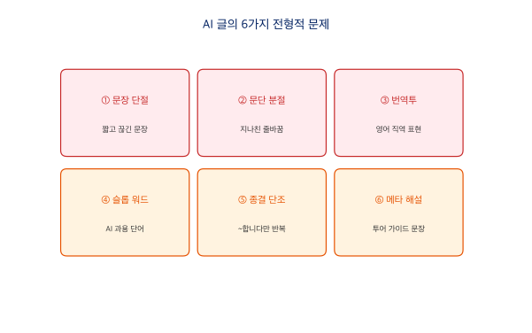

# 5장 AI 글 평가와 교정

AI가 생성한 글은 문법적으로 맞아도 "AI가 쓴 것 같은" 느낌을 줄 때가 많습니다. 그 느낌의 정체를 구체적 기준으로 분해하고, 직접 교정하는 방법을 배워봅시다.

## AI 한국어 글의 6가지 전형적 문제



### 문제 1: 문장이 짧고 단절적이다

AI는 한 문장에 하나의 정보만 담고 끊는 경향이 있습니다. 한국어는 접속 어미('~이고,', '~인데,', '~하는데,')로 문장을 자연스럽게 이어가는 언어인데, AI 글은 이 연결이 빠져 있어 딱딱하게 느껴집니다.

!!! failure "AI투 (X)"
    GB200 같은 가속기는 Plug & Play로 설정이 끝나는 장비가 아닙니다. 제대로 사용하기 위해서는 상당히 복잡한 설정과 관리가 필요합니다.

!!! success "자연스러운 한국어 (O)"
    GB200과 같은 데이터센터급 가속기는 Plug & Play로 설정을 끝낼 수 있는 장비들이 아니고, 제대로 사용하기 위해서는 꽤나 복잡한 설정과 관리가 필요합니다.

**교정 포인트:** '~이고,', '~인데,', '~하는데,' 같은 연결 어미로 문장을 이어 붙이세요.

### 문제 2: 문단을 지나치게 자주 나눈다

한두 문장을 쓰고 바로 줄을 바꾸면 글이 산만해 보입니다. 하나의 문단은 하나의 생각을 최소 3~4문장으로 전개해야 합니다.

!!! failure "AI투 (X)"
    GPU 클러스터 운영에서 활용률은 핵심 지표입니다.

    업계 조사에 따르면 평균 활용률은 30~50%에 머물고 있습니다.

!!! success "자연스러운 한국어 (O)"
    GPU 클러스터 운영에서 활용률은 핵심 지표인데, 업계 조사에 따르면 평균 활용률은 30~50%에 머물고 있습니다. 100대 규모의 클러스터라면 절반 이상의 연산 능력이 유휴 상태로 놀고 있는 셈이죠.

### 문제 3: 번역투 표현

영어 구문을 직역한 표현이 섞여 있으면 어색합니다.

| 번역투 (X) | 자연스러운 대안 (O) |
|-----------|-----------------|
| ~하는 것이 중요합니다 | 왜 중요한지 직접 서술 |
| ~에 있어 | ~에서, ~할 때 |
| ~를 기반으로 한 | ~로 만든, ~위에 세운 |
| ~함으로써 | ~하면, ~해서 |
| ~에 대한 깊은 이해 | ~를 잘 아는 것 |

### 문제 4: 슬롭 워드 (AI 과용 단어)

AI가 통계적으로 너무 자주 쓰는 단어들이 있습니다. 전면 금지가 아니라 무의식적 반복을 경계해야 합니다.

- **형용사/부사:** 혁신적인, 획기적인, 선도적인, 차별화된, 탁월한, 원활한, 강력한
- **접속구:** 이를 통해, 이를 바탕으로, 이와 같이, 이러한 가운데
- **전환어:** 또한, 더불어, 나아가, 한편, 특히, 무엇보다

한 문서에서 같은 전환어가 2회 이상 나오면 과용입니다.

### 문제 5: 종결 어미가 단조롭다

'~합니다', '~있습니다'로만 문장을 끝내면 기계가 쓴 느낌이 강해집니다.

!!! failure "AI투 (X)"
    Backend.AI는 GPU를 관리합니다. Fractional GPU 기술을 제공합니다. 110개 이상의 사이트에서 운영되고 있습니다.

!!! success "자연스러운 한국어 (O)"
    ~입니다, ~됩니다, ~셈입니다, ~마찬가지입니다, ~죠, ~는데요 등을 섞어 사용하면 훨씬 자연스럽습니다.

### 문제 6: 메타 해설 (투어 가이드 문장)

내용을 직접 서술하지 않고, 한 발 물러서서 내용에 '대해' 해설하는 문장입니다.

| 메타 해설 (X) | 직접 서술 (O) |
|--------------|-------------|
| 핵심은 ~입니다 | 핵심이라 부르는 내용을 바로 서술 |
| 가장 뚜렷한 사례는 A입니다 | 'A에서는...' 하고 바로 진입 |
| 이는 X의 결과로 볼 수 있습니다 | X이기 때문입니다 |
| 몇 가지 이점이 생깁니다: | 이점을 바로 서술 |

## AI에게 글을 평가시키는 프롬프트

AI가 생성한 글을 다시 AI에게 평가시킬 수 있습니다.

### 종합 평가 프롬프트

```
다음 글을 아래 6가지 기준으로 평가해 주세요.
각 항목마다 (O) 양호 또는 (X) 개선 필요를 표시하고,
(X)인 경우 해당 문장을 인용한 뒤 교정안을 제시해 주세요.

1. 문장 연결: 접속 어미 없이 짧게 끊긴 문장이 있는가?
2. 문단 분절: 한두 문장만으로 이루어진 문단이 있는가?
3. 번역투: "~하는 것이 중요합니다", "~에 있어", "~함으로써" 등이 있는가?
4. 슬롭 워드: "혁신적인", "획기적인", "이를 통해" 등 AI 과용 단어가 있는가?
5. 종결 어미: "~합니다/~있습니다"만 반복되지 않는가?
6. 메타 해설: "핵심은~", "사례는~", "이점이 생깁니다:" 등 투어 가이드 문장이 있는가?

[평가할 글 붙여넣기]
```

### 비교 평가 프롬프트

```
아래 두 글은 같은 내용을 다른 말투로 쓴 것입니다.
각각의 장단점을 분석하고, 어떤 상황에서 어떤 글이 더 적합한지 설명해 주세요.
평가 기준: 정보 전달력, 독자 친근감, 신뢰감, 전문성

[글 A 붙여넣기]
[글 B 붙여넣기]
```

### 교정 요청 프롬프트

```
다음 글에서 AI가 쓴 것 같은 부분을 모두 찾아 주세요.
각 부분에 대해:
1. 원문 인용
2. 어떤 AI 패턴에 해당하는지 (번역투 / 슬롭 워드 / 단절적 문장 / 메타 해설 등)
3. 교정안
을 표로 정리해 주세요.

[교정할 글 붙여넣기]
```

## 말투별 평가 결과

4장에서 생성한 6가지 말투의 결과를 위 평가 기준으로 분석하면 다음과 같습니다.

| 말투 | 문장 연결 | 번역투 | 슬롭 워드 | 종결 다양성 | 메타 해설 |
|------|----------|--------|----------|-----------|----------|
| A. 강의형 | O | O | O | O (~거든요, ~인데요, ~예요 혼용) | O |
| B. 경험자형 | O | O | O | O (~거든요, ~됐습니다, ~줍니다 혼용) | O |
| C. 보고서형 | △ | **X** (~함으로써, 아울러) | O | △ (~입니다 반복) | O |
| D. 선배형 | O | O | O | O (~거야, ~줄어, ~보면 돼 혼용) | O |
| E. 마케팅형 | O | O | O | O | O |
| F. 기사형 | O | △ (~가운데) | △ (이 같은) | O | △ |

보고서형(C)은 격식을 높이려다 번역투('~함으로써', '아울러')가 들어가기 쉽고, 기사형(F)은 객관성을 추구하면서 '이 같은', '~가운데' 같은 AI 과용 접속구가 나타납니다. 반면 강의형(A)과 경험자형(B)은 구어체 특성상 AI 패턴이 가장 적게 나타납니다.

## AI의 한계와 윤리


### 환각 (Hallucination)

AI가 사실이 아닌 정보를 마치 사실인 것처럼 자신있게 답하는 현상입니다. 존재하지 않는 논문, 가짜 인용, 틀린 통계를 만들어낼 수 있습니다. AI는 '그럴듯한 다음 단어'를 예측하는 것이지 '사실'을 아는 것이 아니므로, 학술 논문 인용은 반드시 직접 확인해야 합니다.

### 그 외 한계

| 한계 | 설명 | 예시 |
|------|------|------|
| 최신 정보 부족 | 학습 데이터 이후 정보를 모름 | '어제 축구 결과 알려줘' → 답변 불가 |
| 개인 경험 부재 | 자기만의 경험이나 감정이 없음 | '네 생각은?' → 사실은 '생각'이 없음 |
| 수학적 추론 | 복잡한 수학 문제에서 실수 | 긴 계산, 논리 퍼즐 등 |
| 일관성 부족 | 같은 질문에 다른 답변 | 매번 결과가 조금씩 달라짐 |

### 윤리적 주의사항

AI를 활용할 때 지켜야 할 원칙이 있습니다.

- **표절 주의:** AI가 쓴 글을 그대로 제출하면 표절이 될 수 있습니다.
- **출처 명시:** AI를 활용했다면 AI 사용 사실을 밝히는 것이 정직합니다.
- **개인정보 보호:** 개인 정보나 민감한 데이터를 AI에 입력하지 않습니다.
- **편향 인식:** AI 답변에도 편향이 있을 수 있음을 인지합니다.
- **검증 습관:** AI의 답변을 무조건 신뢰하지 말고 확인합니다.

AI는 강력한 도구입니다. 최종 판단은 항상 사람이 해야 합니다.
